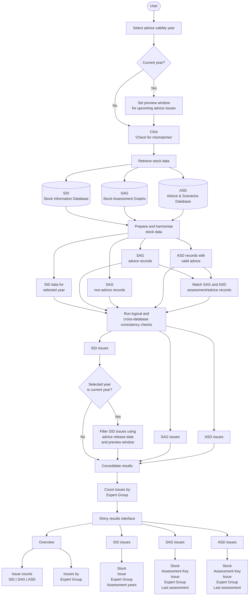

# icesConsistenSEA
Shiny App that tests three connected aspects of stock data: completeness in SID, availability of assessments in SAG, and availability of corresponding published advice in ASD.

## Database consistency checks

The application checks for inconsistencies within and between three ICES databases:

- **SID:** Stock Information Database
- **SAG:** Standard Assessment Graphs
- **ASD:** Advice and Scenarios Database

The checks identify missing records, inconsistent assessment years, incomplete stock information, and issues with the availability or status of advice.

### Summary of checks

| Database | Check | Description |
|---|---|---|
| SID | Next assessment year | Identifies stocks where `YearOfNextAssessment` is earlier than or equal to the selected advice validity year. |
| SID | Advice Drafting Group (ADG) | For the current calendar year, identifies stocks due for assessment whose ADG is not found in the advice release table. |
| SID | Required fields | Identifies stocks with missing values in required identification, species, assessment, advice, or guild fields. |
| SID | Guild information | Identifies stocks with missing trophic, fisheries, or size guild information, or guild fields containing the literal text `"NA"`. |
| SID | Missing stock entry | Identifies stocks with a SAG advice record but no corresponding SID entry for the selected active year. |
| SID | Last assessment year | Identifies stocks where `YearOfLastAssessment` in SID is earlier than `AssessmentYear` in SAG. |
| SAG | Replaced advice | Identifies stocks whose latest non-advice SAG record has no corresponding valid SAG advice record. |
| SAG | Missing assessment | Identifies stocks selected in SID for the relevant assessment year that have no corresponding SAG advice record. |
| ASD | Missing published advice | Identifies SAG advice assessments without a corresponding published ASD entry or valid alternative for the same stock and assessment year. |
| ASD | Replaced advice | Identifies ASD entries with status `Replaced` that have no valid alternative for the same stock and assessment year. |

### How the checks are performed

The application retrieves SID and SAG data for the selected year and ASD records for that year and the preceding three years. It then prepares the data and runs the consistency checks.

The checks are grouped by the database in which the issue is reported. Some checks compare records across multiple databases.

**SID checks** focus on the completeness and consistency of stock information, including assessment years, stock identification, advice drafting groups, and guild classifications.

**SAG checks** focus on the availability of assessment records and identify cases where advice records are missing or have been replaced without a valid alternative.

**ASD checks** focus on the availability and status of published advice corresponding to SAG assessments.

The results are presented as database-specific issues and summarised by Expert Group.

